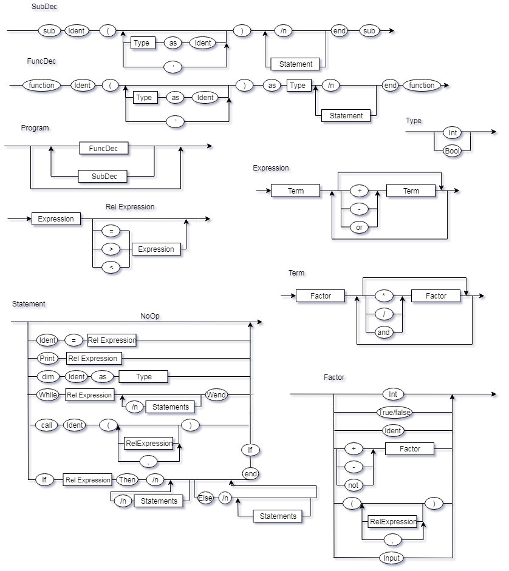

# Compyler
FLC

## Diagramas 

## EBNF
Program = { FuncDec | SubDec };  
 
FuncDec = { "Function", Identifier, "(", (Identifier, "as", Type | lambda ), ")", "as", Type, "\n", (Statement, "\n" | lambda ) "end", "function"}; 
 
SubDec = { "Sub", Identifier, "(", (Identifier, "as", Type | lambda ), ")", "\n", (Statement, "\n" | lambda ) "end", "sub"}; 
Statement = (lambda | Identifier, "=", RelExpression | "Print", RelExpression | "While", RelExpression, Statements, "Wend") | "If", RelExpression, "Then", Statements, (lambda | ("else", Statement)) "end", "if" | "dim", Identifier, "as", Type | "Call", Identifier, "(", (lambda  | RelExpression,  | ","); 
 
RelExpression = Expression, (lambda | (“>” | “<” | “=” ), Expression); 
 
Expression = Term, { ( lambda | “+” | “-”), Term }; 
 
Term =  Factor, { (“*” | “/” | "and"), Factor }; 
 
Factor = (“+” | “-”), Factor | INT | “(”, (RelExpression  | ","  | lambda), “)” | "Identifier" | "Input" ; 
 
Type = "Integer" | "Boolean";  
